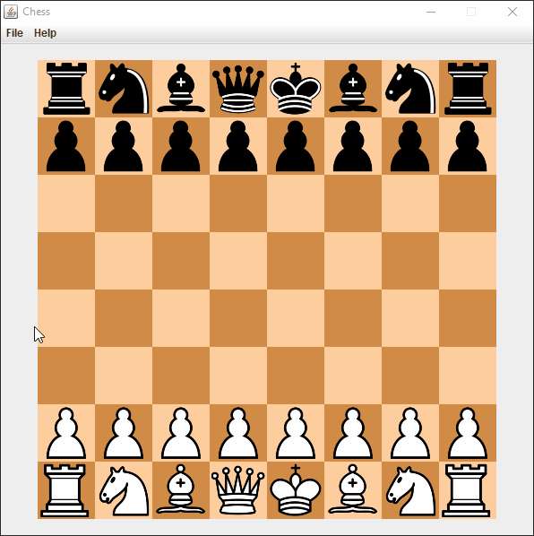

# Chess

### Description
Chess is a game played against two players, competing to place their opponents king into a checkmate positions, where no further moves on the board can be made.

### Features
The following features are the core functionalities that the game will offer.
- [x] Base Game
- [x] Guides
- [x] Debugger
- [x] En-Passent
- [x] Castling
- [x] Stalemate
- [ ] Algebraic Notation Support
- [ ] Player-versus-Player Online
- [ ] Player-versus-Computer Offline
- [ ] Audio Support
- [ ] Animation Support